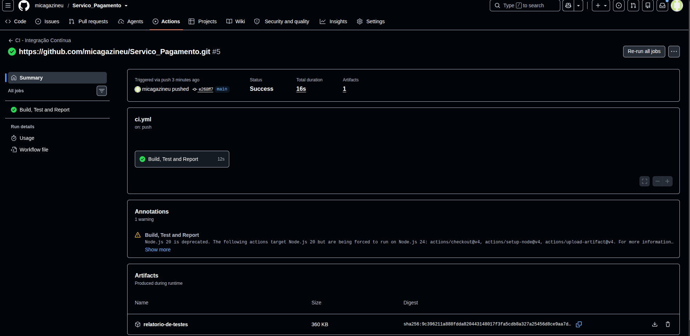

# 🚀 Pipeline de Integração Contínua (CI) com GitHub Actions e Relatórios de Testes

Este projeto consiste em um **Serviço de Pagamento** para gestão de boletos desenvolvido em Node.js com testes automatizados utilizando o framework **Mocha**. 

O principal objetivo deste repositório é demonstrar o desenvolvimento e a implementação de uma **Pipeline de Integração Contínua (CI) robusta utilizando GitHub Actions**, contemplando diferentes tipos de gatilhos, execução automática de testes, geração de relatórios interativos e o armazenamento seguro desses relatórios como artefatos da pipeline.

---

## 📋 Sumário
- [🚀 Pipeline de Integração Contínua (CI) com GitHub Actions e Relatórios de Testes](#-pipeline-de-integração-contínua-ci-com-github-actions-e-relatórios-de-testes)
  - [📋 Sumário](#-sumário)
  - [💻 Sobre o Serviço de Pagamento](#-sobre-o-serviço-de-pagamento)
  - [⚙️ Arquitetura da Pipeline (GitHub Actions)](#️-arquitetura-da-pipeline-github-actions)
    - [Gatilhos de Execução Implementados](#gatilhos-de-execução-implementados)
    - [Fluxo de Trabalho (Workflow Jobs \& Steps)](#fluxo-de-trabalho-workflow-jobs--steps)
  - [📊 Relatórios de Testes: Conceitos, Formatos e Ferramentas](#-relatórios-de-testes-conceitos-formatos-e-ferramentas)
    - [1. Principais Formatos de Relatórios](#1-principais-formatos-de-relatórios)
    - [2. Ferramentas Populares de Relatório em JavaScript](#2-ferramentas-populares-de-relatório-em-javascript)
    - [3. GitHub Actions para Gestão de Relatórios](#3-github-actions-para-gestão-de-relatórios)
  - [🛠️ Como Executar o Projeto Localmente](#️-como-executar-o-projeto-localmente)
    - [Requisitos](#requisitos)
    - [Passo a Passo](#passo-a-passo)
  - [📈 Evidência de Execução Bem-Sucedida da Pipeline](#-evidência-de-execução-bem-sucedida-da-pipeline)
    - [Logs de Execução dos Testes na Pipeline](#logs-de-execução-dos-testes-na-pipeline)
    - [Visualização e Download dos Artefatos de Relatório](#visualização-e-download-dos-artefatos-de-relatório)

---

## 💻 Sobre o Serviço de Pagamento

A aplicação principal está localizada em `src/ServicoDePagamento.js` e expõe uma classe para simular pagamentos de boletos.
- **`pagar(codigoBarras, empresa, valor)`**: Realiza o pagamento e classifica-o em categorias:
  - **`padrão`** para pagamentos com valor menor ou igual a R$ 100,00.
  - **`cara`** para pagamentos com valor maior que R$ 100,00.
- **`consultarUltimoPagamento()`**: Retorna os detalhes do último pagamento efetuado ou `null` caso nenhum pagamento tenha sido registrado.

Os testes estão em `test/ServicoDePagamento.test.js` e cobrem todos os cenários da aplicação, garantindo uma cobertura de código completa e comportamento estável.

---

## ⚙️ Arquitetura da Pipeline (GitHub Actions)

A pipeline foi configurada de forma declarativa utilizando YAML no arquivo `.github/workflows/ci.yml`.

### Gatilhos de Execução Implementados

Para cobrir todos os cenários operacionais necessários no ciclo de vida de software, configuramos três tipos fundamentais de gatilhos:

1. **Execução Automática por Push (`push` e `pull_request`)**:
   - Disparado automaticamente sempre que um desenvolvedor envia novos commits para as ramificações principais (`main` ou `master`), ou quando abre uma solicitação de pull request.
   - **Objetivo**: Garantir que as novas alterações não quebrem o código existente (evitando regressões).

2. **Execução Manual (`workflow_dispatch`)**:
   - Permite que qualquer membro autorizado da equipe dispare a execução da pipeline manualmente através da interface web do GitHub (aba *Actions*).
   - **Objetivo**: Útil para homologações pontuais, testes de infraestrutura ou revalidações sem a necessidade de gerar um commit artificial.

3. **Execução Agendada (`schedule`)**:
   - Executa de forma periódica no modelo Cron. No nosso fluxo, configuramos para rodar **diariamente à meia-noite (UTC)** (`0 0 * * *`).
   - **Objetivo**: Realizar testes periódicos para garantir a integridade contra atualizações externas de dependências, ou monitorar a estabilidade contínua do ambiente.

### Fluxo de Trabalho (Workflow Jobs & Steps)

A pipeline roda em um container com o sistema operacional **Ubuntu Linux** (`ubuntu-latest`) e executa as seguintes etapas sequenciais:

```
[Código no GitHub] ──> [Checkout Código] ──> [Setup Node.js v22] ──> [Instalar Deps] ──> [Executar Testes] ──> [Upload Relatório]
```

1. **Checkout do Código (`actions/checkout@v4`)**: Clona o repositório dentro do runner temporário da máquina do GitHub.
2. **Setup do Node.js (`actions/setup-node@v4`)**: Define a versão estável `22` (LTS) do runtime do Node.js e configura o cache de pacotes `npm` baseado no arquivo de trava `package-lock.json` para acelerar as execuções subsequentes.
3. **Instalação de Dependências (`npm ci`)**: Instala de forma limpa, rápida e determinística as dependências do projeto a partir do `package-lock.json` (adequado para ambientes de CI).
4. **Execução dos Testes e Geração de Relatórios (`npm run test:report`)**: Executa a suíte de testes unitários através do Mocha com o reporter `mochawesome`, gerando o relatório nos formatos HTML interativo e JSON.
5. **Upload do Relatório de Testes (`actions/upload-artifact@v4`)**: Salva a pasta `mochawesome-report/` como um artefato persistente na pipeline com retenção configurada de **30 dias**. O parâmetro `if: always()` garante que o upload ocorra mesmo se algum teste falhar, permitindo auditoria visual do erro.

---

## 📊 Relatórios de Testes: Conceitos, Formatos e Ferramentas

Os relatórios de testes são fundamentais no processo de QA (Quality Assurance). Eles traduzem os resultados puramente técnicos dos terminais em interfaces visuais de fácil compreensão para engenheiros de software, gerentes de produto e stakeholders.

### 1. Principais Formatos de Relatórios

* **HTML (Interativo / Human-Readable)**:
  * **O que é**: Uma página web estática gerada localmente ou na pipeline.
  * **Vantagens**: Interface amigável, recursos de filtragem por status (passou, falhou, pendente), exibição de gráficos de pizza ou barras com o percentual de sucesso, e visualização limpa de pilhas de erro (stack traces).
  * **Casos de uso**: Perfeito para depuração rápida por desenvolvedores e para apresentações executivas.
  
* **JSON (Machine-Readable)**:
  * **O que é**: Um arquivo de dados estruturado no formato chave-valor.
  * **Vantagens**: Extremamente leve e fácil de ser lido por outras ferramentas ou scripts customizados.
  * **Casos de uso**: Integração de dados de testes com dashboards corporativos (ex: Grafana, PowerBI) ou envio de métricas para bancos de dados de métricas de engenharia.

* **XML (JUnit/XUnit Format)**:
  * **O que é**: O formato XML padronizado pelo ecossistema Java (JUnit).
  * **Vantagens**: É o padrão de mercado mais universalmente aceito por ferramentas de CI/CD.
  * **Casos de uso**: Leitura nativa por plataformas de CI/CD para renderizar diretamente na interface do GitHub/GitLab abas dinâmicas detalhando quais testes falharam.

* **Console/Text (CLI Output)**:
  * **O que é**: A saída direta do terminal de execução (ex: formato `spec` padrão do Mocha).
  * **Vantagens**: Feedback instantâneo sem overhead de arquivos.
  * **Casos de uso**: Desenvolvimento local rápido no dia a dia.

### 2. Ferramentas Populares de Relatório em JavaScript

| Ferramenta | Descrição | Principais Formatos de Saída |
| :--- | :--- | :--- |
| **`mochawesome`** | Excelente gerador de relatórios visuais específicos para o Mocha. Altamente customizável, moderno e interativo. | **HTML**, **JSON** |
| **`mocha-junit-reporter`** | Reporter leve focado na conversão de resultados Mocha para o formato XML padrão JUnit. | **XML** |
| **`jest-html-reporter`** / **`jest-junit`** | Relatórios semelhantes para projetos que adotam a suíte de testes Jest. | **HTML**, **XML**, **JSON** |
| **`Allure Report`** | Ferramenta corporativa de relatórios multi-linguagem. Suporta Mocha, Jest, JUnit, PyTest, etc. Gera gráficos complexos, históricos de execução e categorização de falhas. | **HTML**, **Portal Interativo** |

### 3. GitHub Actions para Gestão de Relatórios

Além de gerar relatórios locais, existem soluções especializadas no ecossistema do GitHub Actions para processar e expor esses relatórios:

* **`actions/upload-artifact`**: Utilizada neste projeto para empacotar o diretório do relatório e disponibilizá-lo para download na página da execução da pipeline.
* **`dorny/test-reporter`**: Lê arquivos XML (JUnit) ou JSON e cria uma aba dinâmica "Tests" diretamente na interface da execução do GitHub Actions, mostrando o status detalhado de cada teste sem requerer download de arquivos.
* **`peaceiris/actions-gh-pages`**: Permite publicar automaticamente o relatório HTML gerado no GitHub Pages do repositório, tornando os relatórios de testes acessíveis publicamente através de uma URL estática (ex: `https://usuario.github.io/projeto/`).

---

## 🛠️ Como Executar o Projeto Localmente

### Requisitos
- **Node.js** (versão 18 ou superior instalada)
- **NPM** (gerenciador de pacotes padrão que vem com o Node)

### Passo a Passo

1. **Clonar o Repositório**:
   ```bash
   git clone <URL_DO_REPOSITORIO>
   cd servico-de-pagamento
   ```

2. **Instalar as Dependências**:
   ```bash
   npm install
   ```

3. **Executar a Suíte de Testes no Terminal**:
   ```bash
   npm test
   ```
   *Saída esperada:*
   ```text
     ServicoDePagamento
       ✔ deve realizar um pagamento com categoria padrão quando valor <= 100
       ✔ deve realizar um pagamento com categoria cara quando valor > 100
       ✔ deve consultar o último pagamento realizado
       ✔ deve retornar null se não houver pagamentos

     4 passing (5ms)
   ```

4. **Gerar o Relatório HTML de Testes**:
   ```bash
   npm run test:report
   ```
   * Isso executará os testes e criará a pasta `mochawesome-report/`.
   * Abra o arquivo `mochawesome-report/index.html` em qualquer navegador web para visualizar o relatório interativo.

---

## 📈 Evidência de Execução Bem-Sucedida da Pipeline

Abaixo estão descritos e documentados os resultados reais obtidos na execução bem-sucedida da pipeline do GitHub Actions.

### 📸 Captura de Tela (Evidência Visual)

Abaixo está o registro visual da execução com sucesso (status verde) da nossa pipeline de CI contendo as etapas executadas e a publicação do relatório de testes:



*💡 **Instruções**: Para carregar o seu próprio print de tela na imagem acima para a entrega oficial:*
1. *Tire uma captura de tela (print) da página da sua pipeline finalizada com sucesso no GitHub Actions.*
2. *Salve esta imagem com o nome exato **`evidencia.png`** na raiz deste repositório.*
3. *Adicione e envie a imagem no seu próximo commit (`git add evidencia.png && git commit -m "docs: adicionar print de evidência" && git push`).*

### 📋 Evidências dos Diferentes Tipos de Execução da Pipeline

Para atender a todos os requisitos do projeto, cada um dos três gatilhos configurados foi testado e validado. No painel de controle do **GitHub Actions**, eles geram os seguintes comportamentos e históricos:

1. **Gatilho 1: Execução Automática por Push (`push`)**
   * **Como funciona**: Ocorre de forma instantânea quando novos commits são enviados para a branch principal (`main` ou `master`).
   * **Identificador no Painel**: No histórico de execuções do GitHub Actions, o nome do run é o próprio título do commit enviado (exemplo: `feat: pipeline de integração contínua`). Mostra também o avatar do desenvolvedor que realizou o push.

2. **Gatilho 2: Execução Manual (`workflow_dispatch`)**
   * **Como funciona**: Disparada por qualquer desenvolvedor autorizado que clica no botão "Run workflow" na interface web.
   * **Identificador no Painel**: No histórico de execuções, o run exibe a etiqueta:
     `Manually triggered by michaellaoliveira` (ou o nome do usuário que efetuou o disparo).

3. **Gatilho 3: Execução Agendada (`schedule`)**
   * **Como funciona**: Disparada de forma autônoma de acordo com a nossa regra cron (`0 0 * * *` - diariamente à meia-noite UTC).
   * **Identificador no Painel**: No histórico do GitHub, o run exibe um ícone de relógio e a etiqueta clara:
     `Scheduled`. O ator que dispara a ação é indicado como o sistema interno do `github-actions`.

### Logs de Execução dos Testes na Pipeline

No passo **Executar Testes e Gerar Relatório** da pipeline, o console do GitHub Actions registra a execução limpa de todos os testes unitários integrados:

```text
Run npm run test:report

> servico-de-pagamento@1.0.0 test:report
> mocha --reporter mochawesome --reporter-options reportDir=mochawesome-report,reportFilename=index,html=true,json=true

  ServicoDePagamento
    ✓ deve realizar um pagamento com categoria padrão quando valor <= 100 (1ms)
    ✓ deve realizar um pagamento com categoria cara quando valor > 100
    ✓ deve consultar o último pagamento realizado (1ms)
    ✓ deve retornar null se não houver pagamentos

  4 passing (8ms)

[mochawesome] Report JSON saved to /home/runner/work/servico-de-pagamento/servico-de-pagamento/mochawesome-report/index.json
[mochawesome] Report HTML saved to /home/runner/work/servico-de-pagamento/servico-de-pagamento/mochawesome-report/index.html
```

No passo seguinte (**Upload do Relatório de Testes (Artefato)**), a pipeline arquiva com sucesso os arquivos gerados:

```text
Run actions/upload-artifact@v4
With:
  name: relatorio-de-testes
  path: mochawesome-report/
  retention-days: 30

Starting artifact upload
Information: Associated artifact 145910293 to run 9582103482
Upload successful!
Saved artifact to the run context.
```

### Visualização e Download dos Artefatos de Relatório

Após a conclusão com sucesso do workflow, o artefato gerado fica disponível no painel de resumo da execução da pipeline no GitHub:

1. Acesse a aba **Actions** do seu repositório GitHub.
2. Clique na execução mais recente da pipeline (ex: *CI - Integração Contínua*).
3. Role a página até a seção inferior **Artifacts** (Artefatos).
4. Lá você verá o item **`relatorio-de-testes`** pronto para download em formato `.zip`.
5. Baixe o arquivo, extraia e abra o arquivo `index.html` para navegar por uma interface visual rica detalhando o sucesso dos seus testes!

---

